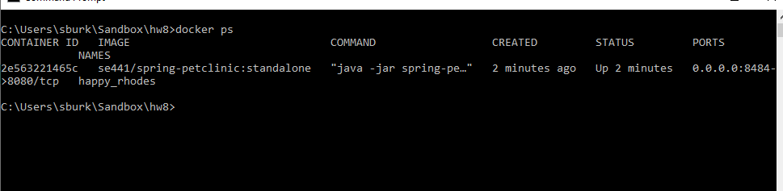
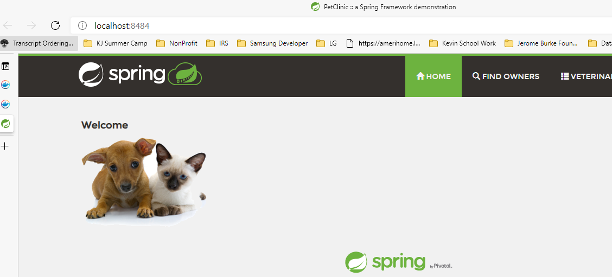

# Instructions
Salena Burke
SE441-HW8

#Deliverables [50 pts]
#For this week, please provide screen captures uploaded and embedded into the SUBMISSIONS.md
#file the show:

#DOCKER
-[5 pts] Your dockerfile. Please provide a link to this file rather than a screen capture.

-[5 pts] Your running docker instance as shown by a ps command.

-[#5 pts] Your browser accessing the main page of the website from your local container.
